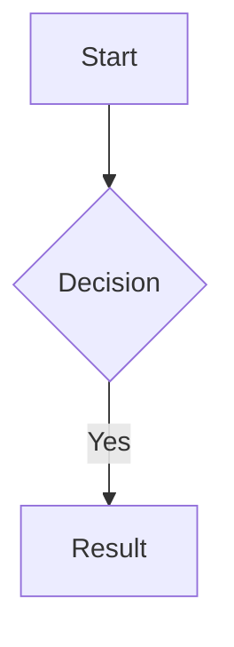

# Obsidian Flavored Markdown Skill

This skill enables creating and editing valid Obsidian Flavored Markdown.

## Overview

Obsidian uses CommonMark + GitHub Flavored Markdown + LaTeX + Obsidian-specific extensions.

## Internal Links (Wikilinks)

```markdown
[[Note Name]]
[[Note Name|Display Text]]
[[Note Name#Heading]]
[[#Heading in same note]]
[[Note Name#^block-id]]
```

## Embeds

```markdown
![[Note Name]]
![[Note Name#Heading]]
![[image.png|300]]
```

## Callouts

```markdown
> [!note]
> Content

> [!info] Custom Title
> Content

> [!tip]- Collapsed by default
> Hidden content
```

Types: `note`, `abstract`/`summary`/`tldr`, `info`, `todo`, `tip`/`hint`/`important`, `success`/`check`/`done`, `question`/`help`/`faq`, `warning`/`caution`/`attention`, `failure`/`fail`/`missing`, `danger`/`error`, `bug`, `example`, `quote`/`cite`

## Properties (Frontmatter)

```yaml
---
title: My Note Title
date: 2024-01-15
tags:
  - project
  - important
aliases:
  - Alternative Name
cssclasses:
  - custom-class
---
```

### Property Types
- Text: `title: My Title`
- Number: `rating: 4.5`
- Checkbox: `completed: true`
- Date: `date: 2024-01-15`
- List: `tags: [one, two]`
- Links: `related: "[[Other Note]]"`

## Tags

```markdown
#tag
#nested/tag
```

Tags can contain letters, numbers (not first), underscores, hyphens, forward slashes.

## Highlighting

```markdown
==highlighted text==
```

## Footnotes

```markdown
Text with footnote[^1].
[^1]: Footnote content.
```

## Comments

```markdown
%%hidden comment%%
```

## Block IDs

```markdown
Paragraph text. ^block-id
```

## Diagrams (Mermaid)

````markdown

````

## Best Practices for Notes

1. Always include frontmatter with at least `tags` and `date`
2. Use wikilinks `[[Note Name]]` instead of markdown links for internal links
3. Use callouts for important information
4. Use properties for metadata, not inline text
5. Keep tag naming consistent with `kebab-case`
